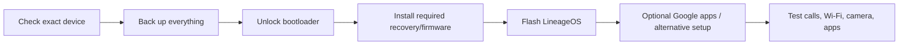

<div align="center">

# 📱 Android FOSS Starter Kit

### Build a cleaner, more open Android setup without turning your phone into a science project.

Open-source apps, safer alternative app sources, practical privacy upgrades, and a **real LineageOS path** for people who want to go further.

[](#)
[](LINEAGEOS.md)
[](APP-SOURCES.md)
[](#)

### [✨ App picks](APP-PICKS.md) · [📦 App sources](APP-SOURCES.md) · [⚡ LineageOS](LINEAGEOS.md) · [🛡 Privacy basics](PRIVACY-BASICS.md)

</div>

---

## 🎯 Pick your level

You do **not** need to de-Google your entire life or unlock your bootloader to benefit from FOSS Android software.

<table>
<tr>
<td width="33%" valign="top">

### 🟢 Level 1 — Easy
Keep stock Android.

Replace a few weak/default apps with better FOSS alternatives.

**Best for:** almost everyone.

</td>
<td width="33%" valign="top">

### 🟡 Level 2 — FOSS-first
Use Obtainium, Droid-ify/F-Droid repos and privacy-friendly tools while keeping Play Store compatibility where needed.

**Best for:** power users.

</td>
<td width="33%" valign="top">

### 🔴 Level 3 — LineageOS
Move to a supported custom ROM after understanding unlock, compatibility, backup and app-integrity trade-offs.

**Best for:** supported devices + informed users.

</td>
</tr>
</table>

> **The goal is not ideological purity.** The goal is a phone that is useful, maintainable, updateable and more under your control.

---

## 🚀 Quick start

| Goal | Start here |
|---|---|
| ⭐ Find great FOSS apps | **[APP-PICKS.md](APP-PICKS.md)** |
| 📦 Install/update outside Play Store safely | **[APP-SOURCES.md](APP-SOURCES.md)** |
| ⚡ Flash LineageOS | **[LINEAGEOS.md](LINEAGEOS.md)** |
| 🛡 Improve privacy without breaking everything | **[PRIVACY-BASICS.md](PRIVACY-BASICS.md)** |

### Five-minute starter path

```text
1. Install Obtainium or a trusted F-Droid client
2. Replace one daily app — not twenty
3. Add Ente Auth/Aegis + LocalSend
4. Try a better browser that fits your threat model
5. Only consider LineageOS after checking exact device support
```

---

## ✨ Starter stack

| Category | Recommended picks | Why |
|---|---|---|
| 📦 Upstream updates | **Obtainium** | Tracks releases directly from supported upstream sources |
| 🛍 F-Droid client | **Droid-ify** | Cleaner browsing and repo management |
| 🌐 Browser | **Helium / Cromite / IronFox** | Different engines, privacy goals and maturity trade-offs |
| 🔐 2FA | **Ente Auth / Aegis** | Encrypted sync vs strong local-first Android focus |
| 🔑 Passwords | **Bitwarden / KeePassDX** | Cross-device service vs local database |
| 📁 Files | **Material Files** | Clean open-source file manager |
| 📤 Nearby transfer | **LocalSend** | Fast cross-platform local sharing |
| ⌨️ Keyboard | **HeliBoard / FlorisBoard** | FOSS keyboard choices without cloud dependency |
| ✉️ Email | **Thunderbird / K-9 Mail** | Mature open-source email stack |
| 🎧 Podcasts | **AntennaPod** | Feature-rich FOSS podcast player |
| 🗺 Maps | **Organic Maps / OsmAnd** | Strong offline navigation |
| 🌦 Weather | **Breezy Weather** | Powerful open-source weather client |
| 🖼 Gallery | **Fossify Gallery** | Simple local photo gallery |
| ▶️ YouTube client | **NewPipe** | Lightweight open-source frontend/client |
| 🔥 Firewall | **Rethink DNS + Firewall / NetGuard** | Per-app network control without root |

### 👉 [Browse the full app list →](APP-PICKS.md)

---

## ⚡ LineageOS is a main path, not a footnote

LineageOS can give supported hardware a clean Android base after the vendor stops being useful — but flashing a ROM is not the same thing as installing an app.

<div align="center">

### **Before you unlock anything:**

</div>

| Check | Why it matters |
|---|---|
| ✅ Exact model is officially supported | Similar model names are **not** interchangeable |
| 💾 Full backup completed | Bootloader unlocking commonly wipes user data |
| 🏦 Banking/DRM needs checked | Some apps depend on integrity/security signals |
| 📷 Camera expectations understood | OEM camera processing/features may differ |
| 🔌 Good USB cable + charged battery | A failed flash is a bad time to troubleshoot hardware |
| 📚 Official device wiki read fully | Device-specific steps override generic internet guides |



### **[Read the complete LineageOS guide →](LINEAGEOS.md)**

---

## 📦 Where should apps come from?

Not every good FOSS Android app lives in the Play Store.

| Source | Best for | Notes |
|---|---|---|
| **Official Play Store listing** | Convenience | Fine when the upstream project publishes there |
| **F-Droid / compatible repos** | FOSS discovery | Verify the repo/project you intend to use |
| **Obtainium** | Direct upstream releases | Great when projects publish APKs on GitHub/GitLab/etc. |
| **Official project website** | Direct downloads | Confirm domain and signing/source details |
| ❌ Random APK mirror/mod site | Nothing sensitive | Avoid when a trusted upstream source exists |

Full explanation: **[APP-SOURCES.md](APP-SOURCES.md)**

---

## 🛡 Practical privacy > checkbox privacy

A FOSS badge does not automatically make software private or secure.

### A better checklist

- 🔄 Is the project actively updated?
- 🔏 Is the APK coming from a trusted source?
- 🔐 Does the app actually need the permissions it requests?
- 🌐 Does it make unnecessary network requests?
- 🧩 Is the underlying browser/web engine patched quickly?
- 💾 Can you export/backup your data?
- 🚪 Can you leave the app without being locked in?

For simple hardening steps, use **[PRIVACY-BASICS.md](PRIVACY-BASICS.md)**.

---

## 🧭 A realistic migration plan

```text
Week 1
├─ Install Obtainium or Droid-ify
└─ Replace one app you already dislike

Week 2
├─ Authenticator
├─ Browser
├─ File transfer
└─ Gallery / keyboard

Week 3
├─ Maps / podcasts / mail
└─ Add firewall/privacy tools only if you understand them

Later
└─ Consider LineageOS if your exact device is supported and the trade-offs make sense
```

The best setup is the one you can still maintain six months later.

---

## 🗂 Repository map

| Guide | What you get |
|---|---|
| **[APP-PICKS.md](APP-PICKS.md)** | Curated FOSS app recommendations by category |
| **[APP-SOURCES.md](APP-SOURCES.md)** | Play Store, F-Droid, Obtainium and direct-release guidance |
| **[LINEAGEOS.md](LINEAGEOS.md)** | Practical custom-ROM planning and installation checklist |
| **[PRIVACY-BASICS.md](PRIVACY-BASICS.md)** | Sensible Android privacy hardening |

---

## 🔗 Related projects

<table>
<tr>
<td width="50%" valign="top">

### 🌱 [Open Source Alternatives](https://github.com/ish4ra/open-source-alternatives)
Broader alternatives for browsers, desktop apps, web services and self-hosted tools.

</td>
<td width="50%" valign="top">

### 🏠 [Selfhosted Picks](https://github.com/ish4ra/selfhosted-picks)
A focused shortlist of services worth running yourself.

</td>
</tr>
<tr>
<td width="50%" valign="top">

### 🧰 [Homelab From Zero](https://github.com/ish4ra/homelab-from-zero)
Build the server that can run your own cloud, media, DNS and sync services.

</td>
<td width="50%" valign="top">

### 🎬 [Jellyfin Media Server Guide](https://github.com/ish4ra/jellyfin-media-server-guide)
Build a practical personal media server with safe remote access and good clients.

</td>
</tr>
</table>

---

<div align="center">

## 🤝 Improve the kit

Found a maintained FOSS app that is genuinely better than a listed pick? Open an issue or PR with the reason it deserves a place.

### If this guide helped you build a better Android setup, a ⭐ helps other people find it.

**Use open source because it works for you — not because a checklist told you to.**

</div>